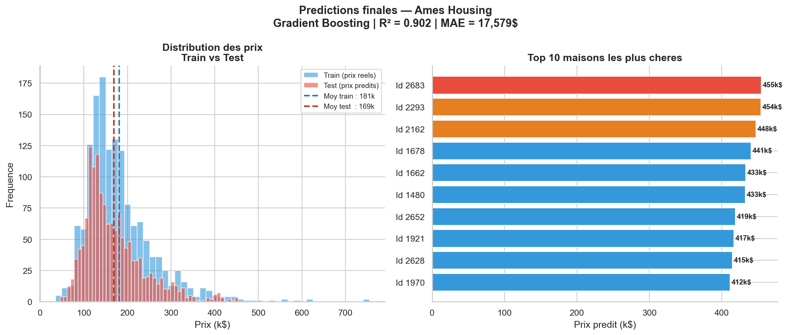

# Ames Housing — Prédiction de Prix Avancée


---

## Description

Analyse avancée du marché immobilier d'Ames, Iowa.
Prédiction du prix de vente à partir de 79 features
couvrant tous les aspects d'une maison résidentielle —
surface, qualité, équipements, localisation, année de construction.

> Projet portfolio — démonstration de compétences en
> nettoyage avancé, Feature Engineering et Machine Learning.
> Soumission Kaggle réalisée avec un score RMSLE de 0.157.

---

## Objectifs

- Nettoyer et imputer intelligemment 19 colonnes avec valeurs manquantes
- Créer de nouvelles features plus informatives (Feature Engineering)
- Sélectionner automatiquement les 50 meilleures features (SelectKBest)
- Comparer 5 modèles ML et atteindre un R² > 0.85
- Prédire les prix du fichier test.csv et soumettre sur Kaggle

---

## Dataset

| Indicateur | Valeur |
|---|---|
| Maisons train | 1 460 |
| Maisons test | 1 459 |
| Features originales | 79 |
| Features après Feature Engineering | 83 |
| Features après One-Hot Encoding | 252 |
| Features sélectionnées (SelectKBest) | 50 |
| Prix moyen train | 180 921 $ |
| Prix moyen prédit test | 176 957 $ |

---

## Pipeline complet

```
Données brutes (79 features)
        ↓
① Nettoyage & imputation intelligente
  - Suppression colonnes > 50% manquants (PoolQC, Alley...)
  - NaN Garage/Basement → 'None' (= pas de garage)
  - LotFrontage → médiane par quartier (Neighborhood)
  - Colonnes catégorielles → mode calculé sur train
        ↓
② Feature Engineering — 8 nouvelles variables
  - qualite_x_surface  = OverallQual × Surface_totale
  - Surface_totale     = Bsmt + 1st + 2nd Floor
  - age_maison         = YrSold - YearBuilt
  - total_bains, age_renovation, maison_neuve...
        ↓
③ One-Hot Encoding (38 variables catégorielles → 169 colonnes)
        ↓
④ Log transformation de SalePrice
  - Skewness brut : 1.883 → après log : 0.121
        ↓
⑤ SelectKBest (f_regression) — 50 meilleures features
        ↓
⑥ Pipeline StandardScaler + Modèle ML
        ↓
⑦ Cross-validation 5 folds + évaluation finale
        ↓
⑧ Prédiction test.csv + soumission Kaggle
```

---

## Performances des modèles ML

| Modèle | R² Test | R² CV | MAE | RMSE |
|---|---|---|---|---|
| Régression Linéaire | 0.858 | 0.840 ± 0.051 | 18 979 $ | 32 997 $ |
| Ridge | 0.874 | 0.835 ± 0.063 | 18 603 $ | 31 141 $ |
| Lasso | 0.871 | 0.833 ± 0.068 | 18 619 $ | 31 431 $ |
| Random Forest | 0.889 | 0.858 ± 0.018 | 17 643 $ | 29 207 $ |
| Gradient Boosting | 0.902 | 0.873 ± 0.021 | 17 579 $ | 27 422 $ |

Meilleur modèle : Gradient Boosting
- R² = 0.902 — objectif 0.85 dépassé
- Erreur moyenne : 17 579 $ sur un prix moyen de 180 000 $ (~9.8%)
- Score Kaggle RMSLE : 0.15764

---

## Score Kaggle

| Indicateur | Valeur |
|---|---|
| Métrique | RMSLE (Root Mean Squared Log Error) |
| Score obtenu | 0.15764 |
| Niveau | Intermédiaire |
| Maisons prédites | 1 459 |
| Prix moyen prédit | 176 957 $ |
| Prix min prédit | 46 047 $ |
| Prix max prédit | 508 030 $ |

Interprétation du score RMSLE :
- Score > 0.20 → débutant
- Score 0.15-0.20 → intermédiaire (notre résultat)
- Score 0.12-0.15 → bon
- Score < 0.10 → expert top 10%

---

## Top features identifiées

| Rang | Feature | Score F | Origine |
|---|---|---|---|
| 1 | qualite_x_surface | 4 002 | Feature Engineering |
| 2 | OverallQual | 2 437 | Originale |
| 3 | Surface_totale | 2 299 | Feature Engineering |
| 4 | GrLivArea | 1 471 | Originale |
| 5 | GarageCars | 1 014 | Originale |
| 6 | total_bains | 968 | Feature Engineering |
| 7 | GarageArea | 927 | Originale |
| 8 | TotalBsmtSF | 880 | Originale |

3 des 6 meilleures features ont été créées par Feature Engineering.

---

## Exemple de prédiction

```
Maison estimée :
  Qualité générale  : 8/10
  Surface totale    : 2 500 sq ft
  Garage            : 2 voitures
  Age               : 10 ans
  Salles de bain    : 3

Estimations par modèle :
  Régression Linéaire  → 190 650 $
  Ridge                → 193 705 $
  Lasso                → 203 091 $
  Random Forest        → 193 943 $
  Gradient Boosting    → 199 162 $
  Prix moyen estimé    → 196 110 $
  Intervalle (± MAE)   → 178 531 $ — 213 689 $
```

---

## Visualisations

### Valeurs manquantes par colonne


### Top 20 features — SelectKBest


### Distribution SalePrice — brut vs log


### Corrélation entre top features


### Comparaison des modèles ML


### Importance des features — Gradient Boosting


### Predictions finales train vs test


---

## Leçons clés

**1 — Cohérence train / test obligatoire**
Les noms de colonnes doivent être identiques sur train et test.
Une majuscule différente (Surface_totale vs surface_totale)
suffit à fausser toutes les prédictions silencieusement.

**2 — Feature Engineering avant tout**
Les 2 meilleures features (qualite_x_surface, Surface_totale)
ont été créées, pas trouvées dans le dataset original.

**3 — Log transformation indispensable**
Skewness 1.883 → 0.121 après log — amélioration significative du R².

**4 — Gradient Boosting séquentiel > Random Forest parallèle**
GB corrige ses erreurs à chaque étape → R² 0.902 vs 0.889 pour RF.

**5 — Pipeline = bonne pratique absolue**
Évite le data leakage lors de la cross-validation.

**6 — Imputer avant SelectKBest**
L'imputer doit être appliqué sur toutes les colonnes
avant la sélection des features — pas après.

---

## Statut du projet

- [x] Chargement et exploration
- [x] Nettoyage et imputation intelligente
- [x] Feature Engineering (8 nouvelles variables)
- [x] One-Hot Encoding
- [x] Log transformation SalePrice
- [x] Sélection de features (SelectKBest k=50)
- [x] Entraînement 5 modèles ML
- [x] Cross-validation avec Pipeline
- [x] Comparaison et évaluation
- [x] Prédiction sur test.csv
- [x] Soumission Kaggle — score 0.15764
- [ ] Optimisation hyperparamètres (GridSearchCV)
- [ ] XGBoost et LightGBM
- [ ] Traitement des outliers

---

## Stack technique

| Librairie | Usage |
|---|---|
| pandas | Manipulation et nettoyage |
| numpy | Calculs & log transformation |
| matplotlib / seaborn | Visualisations statiques |
| plotly | Graphiques interactifs |
| scikit-learn | Pipeline, SelectKBest, ML complet |

---

## Lancer le projet

```bash
git clone https://github.com/VOTRE_USERNAME/ames-housing-analysis.git
cd ames-housing-analysis
pip install -r requirements.txt
jupyter notebook notebooks/analyse_ames.ipynb
```

---

## Structure

```
ames-housing-analysis/
├── data/
│   ├── train.csv
│   └── test.csv
├── notebooks/
│   └── analyse_ames.ipynb
├── outputs/
│   ├── 01_valeurs_manquantes.png
│   ├── 02_top20_features.png
│   ├── 03_distribution_saleprice.png
│   ├── 04_heatmap_correlation.png
│   ├── 05_comparaison_modeles.png
│   ├── 06_importance_features.png
│   └── 07_predictions_finales.png
├── README.md
├── requirements.txt
└── submission.csv
```

---

## Auteur

Mouad AOUS — Ingenieur Qualite de l'Air | Data Analyst
LinkedIn : https://www.linkedin.com/in/mouad-aous/
Email : mouad.aous97@gmail.com